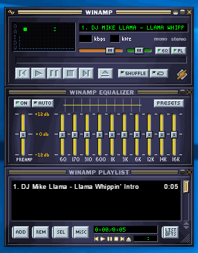
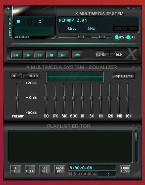

<p align="center">
  <a href="https://desktop.webamp.org/">
    
  </a>

  <h3 align="center">Webamp on desktop</h3>

  <p align="center">
    Just like the original, now on your Mac, Windows or a Linux!
  </p>

  <p align="center">
    <a href="https://desktop.webamp.org" title="Downloads"></a>
    <a href="https://travis-ci.org/durasj/webamp-desktop" title="Build"></a>
    <a href="https://twitter.com/intent/tweet?text=Wow:&url=https%3A%2F%2Fgithub.com%2Fdurasj%2Fwebamp-desktop" title="Tweet"></a>
  </p>
</p>

<br>

[](https://desktop.webamp.org/) [](https://desktop.webamp.org/) [](https://desktop.webamp.org/)

Unofficial app. It has most of the functionality of the original Winamp, but it's still more of a proof of concept. Based on the [Webamp](https://github.com/captbaritone/webamp) - "A reimplementation of Winamp 2.9 in HTML5 and JavaScript." by the [@captbaritone](https://github.com/captbaritone). Linux support via AppImage and .deb package tested on the Ubuntu 18.04.

## Downloads
Head over to the [desktop.webamp.org](https://desktop.webamp.org/) for the latest download files for your platform.

## Ideas for the future

### Higher priority

- "Media Keys" support (Play, Pause, Stop, Previous, Next) via [Media Transport Controls](https://docs.microsoft.com/en-us/windows/uwp/audio-video-camera/system-media-transport-controls) on Windows, MPRemoteCommandCenter on Mac and [D-BUS on Linux](https://specifications.freedesktop.org/mpris-spec/latest/) - inspiration from [electron-media-service](https://github.com/MarshallOfSound/electron-media-service)
- Implement Taskbar media control buttons
- Milkdrop visualizer
- Persisting state of the player

### Lower priority

- Support for multiple displays
- Automatic updates (prepared, notifications already done)
- Support file associations

### Nice to have / Experiments

- Features that can't be in the web version (by extending the API)
- Try to integrate Spotify (inspiration from [winampify-js](https://github.com/remigallego/winampify-js)?), milkdrop can be integrated using microphone (?) due to problems with the DRM

## Known issues

### Installation files are not trusted

Some operating systems, especially Windows or some browsers do not trust the installation files because they are not digitally signed and/or commonly used yet. Unfortunately, code signing certificates that would help us overcome this cost hundreds of euro per year. This project does not have any funding and therefore can't afford it. It's recommended to verify the checksum of the files if you are worried. Every commit (and therefore published checksum) is signed in this repository.

### Poor performance on Linux

Caused by the disabled hardware acceleration on the Linux. The reason is [issues with the transparency on the Chromium project](https://bugs.chromium.org/p/chromium/issues/detail?id=854601#c7).

## Developing

### Prerequisites

Make sure you have latest [node.js](https://nodejs.org/en/) and [yarn](https://yarnpkg.com/lang/en/).

### Installing

Clone this repository, install dependencies and run the start script:

```
git clone https://github.com/durasj/webamp-desktop.git
cd webamp-desktop
yarn install
yarn start
```

After the build has completed, you should see one window with the app and one with developer tools. To try some changes, you can: change the code in the `./src` dir, close the current window and run the `yarn start` again.

## Kudos

This project is possible thanks to the [Webamp](https://github.com/captbaritone/webamp) from [@captbaritone](https://github.com/captbaritone) and wonderful open source work of others like [@jberg](https://github.com/jberg) and authors of [many dependencies](https://github.com/durasj/webamp-desktop/blob/master/package.json).

Thumbar icons on Windows by [Smashicons](https://smashicons.com).

## Disclaimer
Not affiliated with the [Winamp](http://www.winamp.com/). All product names, logos, and brands are property of their respective owners.